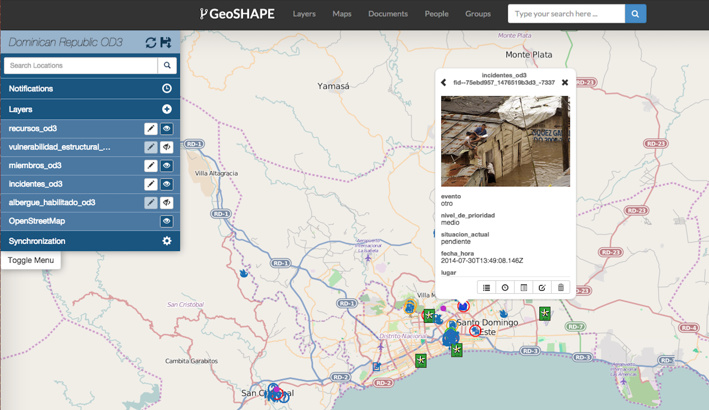
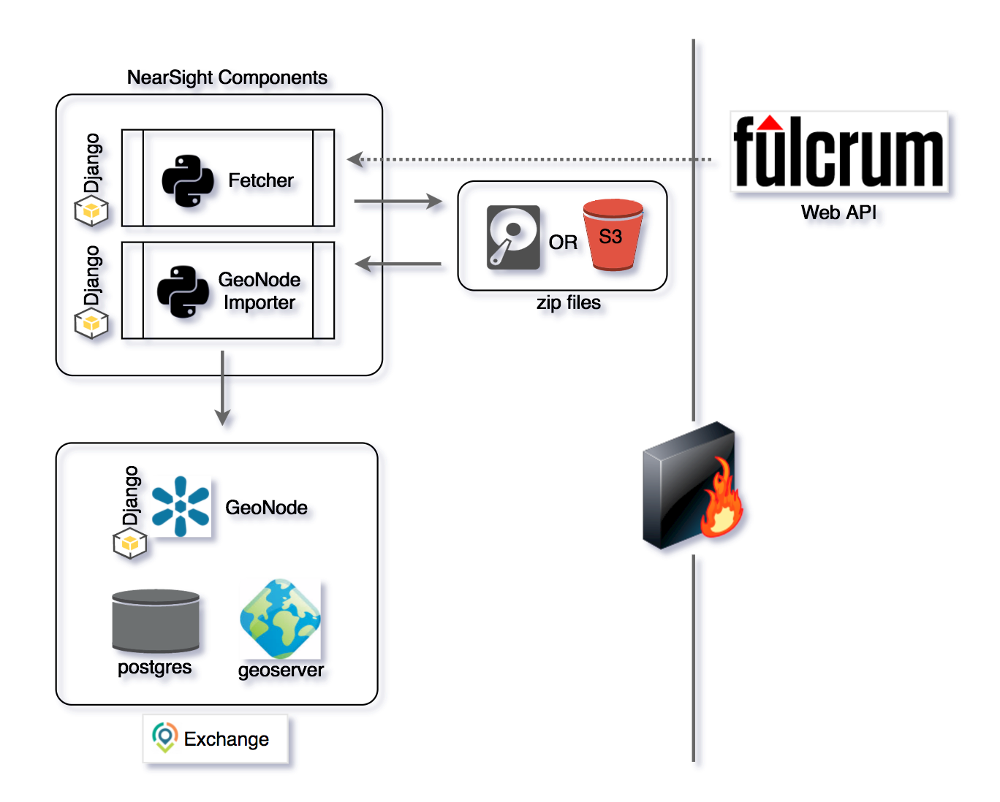

# django-fulcrum

This is a django application which enables importing of fulcrum data into GeoNode. 


Since Maploom supports viewing images attached to a features in a web client, it can be used to view Fulcrum App data.

 

Maploom pulls the images from a fileservice that has been added to Exchange. The following outlines how `django-fulcrum` app adds the features and images collected by Fulcrum to Maploom which has been installed as the viewer in GeoNode. 



Once GeoNode or Exchange has been installed, `django_fulcrum/scripts/install.sh` can be used to install django-fulcrum.  


## Installation
The `django_fulcrum/scripts/install.sh` file performs steps needed to configure the app. The following are the steps performed by the script.  
NOTE: For this app to be functional, you should add at least one of the options: FULCRUM_API_KEYS, FULCRUM_UPLOAD, or S3_CREDENTIALs

##### DATABASES: (Required)
A database in which the geospatial data can be stored. 
Example: 
```
    DATABASES = {
        'fulcrum': {
            'ENGINE': 'django.contrib.gis.db.backends.postgis',
            'NAME': *database name*,
            'USER': *database user*,
            'PASSWORD': *database password*,
            'HOST': *database host*,
            'PORT': *database port*,
        }
    }
 ```

##### OGC_SERVER: (Optional)
Server to host layers in the database.
Example:
```
    OGC_SERVER = {
        'default': {
            'BACKEND': 'backend.geoserver',
            'LOCATION': GEOSERVER_URL,
            'PUBLIC_LOCATION': GEOSERVER_URL,
            'USER': 'admin',
            'PASSWORD': 'xxxxxxx',
            'DATASTORE': 'exchange_imports',
        }
    }
```

##### FULCRUM_API_KEYS: (Optional)
The API key which allows the application access to the data in your Fulcrum account.
Example: `FULCRUM_API_KEY= ['xxxxxxxxxxxxxxxxxxxxxxxxxxxxxxxxxxxxxxx']`
            
##### FULCRUM_UPLOAD: (Optional)
A file path where user uploaded files or S3 files will be stored while processing.
Example: `FULCRUM_UPLOAD = '/var/lib/geonode/fulcrum_data'`

##### S3_CREDENTIALS: (Optional)
Configuration to pull data from an S3 bucket.
Example: 
```
    S3_CREDENTIALS = [{
        's3_bucket': ['my_s3_bucket'],
        's3_key': 'XXXXXXXXXXXXXXXXXXXX',
        's3_secret': 'XxXxXxXxXxXxXxXxXxXxXxX',
        's3_gpg': XxXxXxXxXxXxX'
    }]
```

##### --- NOTE: For this app to be functional, you should add at least one of the options: FULCRUM_API_KEYS, FULCRUM_UPLOAD, or S3_CREDENTIALs ---

##### INSTALLED_APPS: (Required)
The name of this app must be added to the installed_app variable so it can run as part of the host django project.
Example: `INSTALLED_APPS += ('django_fulcrum',)`

##### CACHES: (Required)
Define the cache to be used. Memcache is suggested, but other process safe caches can be used too.
Example: 
```
    CACHES = {
        'default': {
            'BACKEND': 'django.core.cache.backends.memcached.MemcachedCache',
            'LOCATION': '127.0.0.1:11211',
        }
    }
```

##### CELERY: (Optional)
If you plan to use celery as a task runner there are several celery variables to define.
Examples:
```
CELERY_ACCEPT_CONTENT=['json']
CELERY_TASK_SERIALIZER='json'
CELERY_RESULT_SERIALIZER='json'
CELERY_SEND_EVENTS=True
CELERYBEAT_USER='geoshape'
CELERYBEAT_GROUP='geoservice'
CELERYBEAT_SCHEDULER='djcelery.schedulers.DatabaseScheduler'
CELERYBEAT_SCHEDULE = {
    'Update_layers_30_secs': {
        'task': 'django_fulcrum.tasks.task_update_layers',
        'schedule': timedelta(seconds=30),
        'args': None
    },
    'Pull_s3_data_120_secs': {
        'task': 'django_fulcrum.tasks.pull_s3_data',
        'schedule': timedelta(seconds=120),
        'args': None
    },
}
```

##### LEAFLET_CONFIG: (Optional)
Defines the basemaps to be used in the fulcrum viewer map. If you plan to use the fulcrum viewer, you will need to define your selected basemaps here.
Example: 
```
    LEAFLET_CONFIG = {
        'TILES': [
            ('BasemapName',
             'url-to-basemap-server-here',
             'Attribution for the basemap'),
        ]
    }
```

## Usage
Once up and running you need to configure filters and import data from FulrumApp.

To configure the filters, navigate to the django admin console and navigate to django_fulcrum - filters.
Then click on each filter and either make it not active or change the settings.  By default for testing, there are filters active which excludes data in the US.  Optionally, you can switch to show ONLY data in the US, or deactivate the filter.
Filters are available to reduce the amount of undesired redundant data on your remote system.  This is to allow only subsets to exist on the current system. Note that the filters are destructive. If you filter points, the system marks the time that they were "filtered" and won't evaluate them again, so old data won't show up if it was "filtered" previously.  Likewise if you run a new filter on old points, "filtered" points (or media) will be deleted.

To import data you can (all of which will be run through existing filters):
 - upload a geojson zip archive from Fulcrum through the fulcrum_viewer.
 - Enter S3 Credentials to automatically download zip archives from an S3 bucket(s).
 - Enter FulcrumApp API key to download the data directly from Fulcrum.  (Recommended)
 Note that zip files are extracted and imported.  Extracted files are deleted but zip files are left in the FULCRUM_UPLOAD folder.
 The advantage of using the API key is that all of your data will be downloaded and updated automatically. Furthermore it includes videos and audio files that historically have not been included in Fulcrum exports.

## Known Issues
- Tiles are completely dumped when a layer is updated.  This is because the GWC bounding box tools was unsuccessful during various attempts even using their built in web tool.  This solution while inefficient is probably ok for static datasets and rarely updated data, as opposed to just not caching tiles at all.


##  LICENSE

The code for this project is provided under the Apache 2 license. Any contributions to this repository constitutes agreement with your contribtions being provided under this license. 
